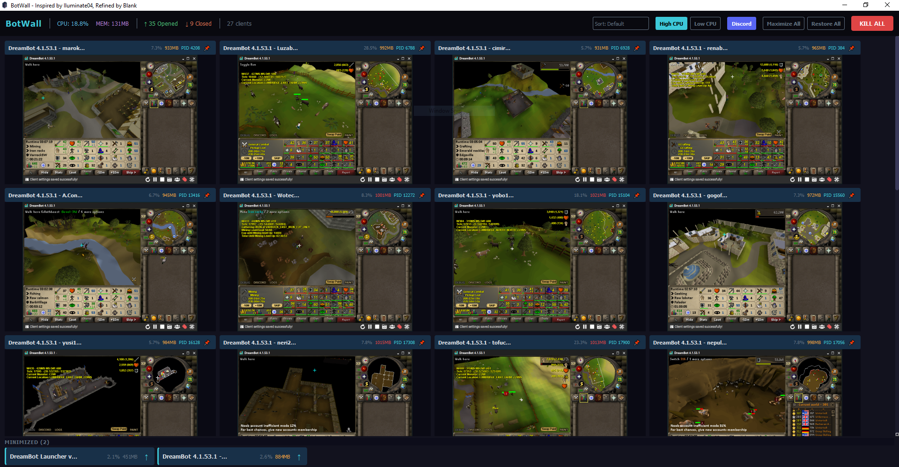
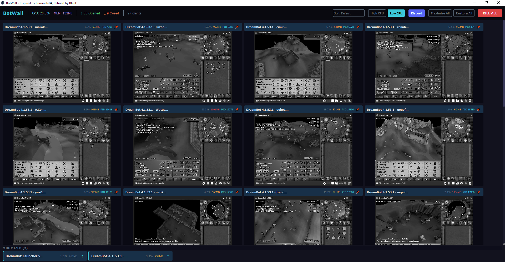

# BotWall

A live screenshot monitor for DreamBot and RuneScape clients on Windows. View all your running clients in a single dashboard with real-time screen capture, CPU/memory stats, and quick window management.

## Features

- **Live screen capture** of all detected DreamBot / RuneScape windows
- **Real-time stats** — CPU usage, memory, process name per client
- **Grid layout** with dynamic column sizing and Ctrl+Scroll zoom
- **Sort clients** by title, CPU, memory, or PID
- **Pin clients** to keep important windows at the front
- **Minimize to shelf** — hide cards from the grid without losing track
- **Maximize / Restore All** toolbar buttons for quick window management
- **High / Low CPU modes** — toggle between 250ms and 1s capture intervals; Low CPU mode switches to grayscale rendering

### High CPU Mode


### Low CPU Mode


## Requirements

- **Windows** (uses Win32 API for window capture)
- Python 3.8+

## Installation

```bash
git clone https://github.com/pspiotto/botwall.git
cd botwall
pip install -r requirements.txt
```

## Usage

```bash
python botwall.py
```

BotWall will automatically detect visible windows with "dreambot", "runescape", or "oldschool runescape" in the title and begin capturing screenshots.

### Controls

| Action | How |
|--------|-----|
| Zoom in/out | Ctrl + Scroll |
| Sort clients | Dropdown in toolbar |
| Pin a client | Click the pin button on the card header |
| Minimize a card | Right-click the card > "Minimize to Shelf" |
| Toggle CPU mode | High CPU / Low CPU buttons in toolbar |
| Maximize/Restore all windows | Toolbar buttons |

## Building a Standalone EXE

```bash
pip install pyinstaller
pyinstaller BotWall.spec
```

The output lands in `dist/BotWall.exe`. The icon files (`CmCSAHz.ico`, `CmCSAHz.png`) must be present alongside `botwall.py` when building.

## License

MIT
